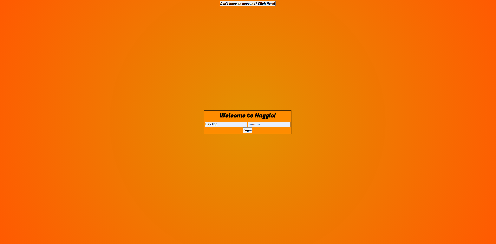
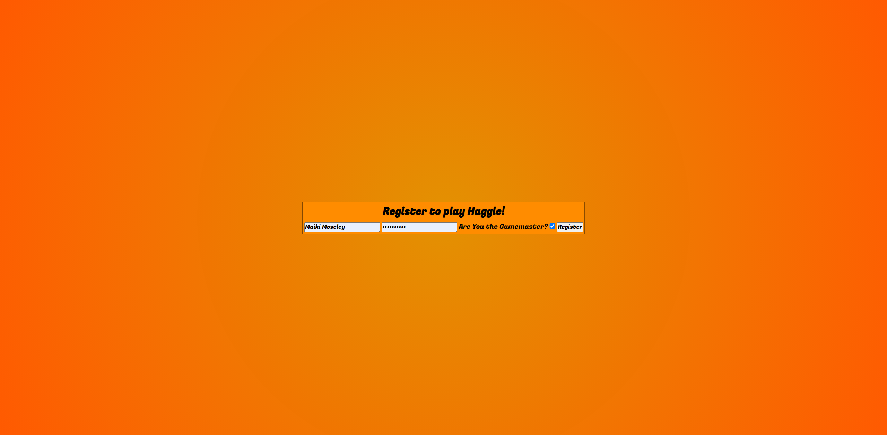
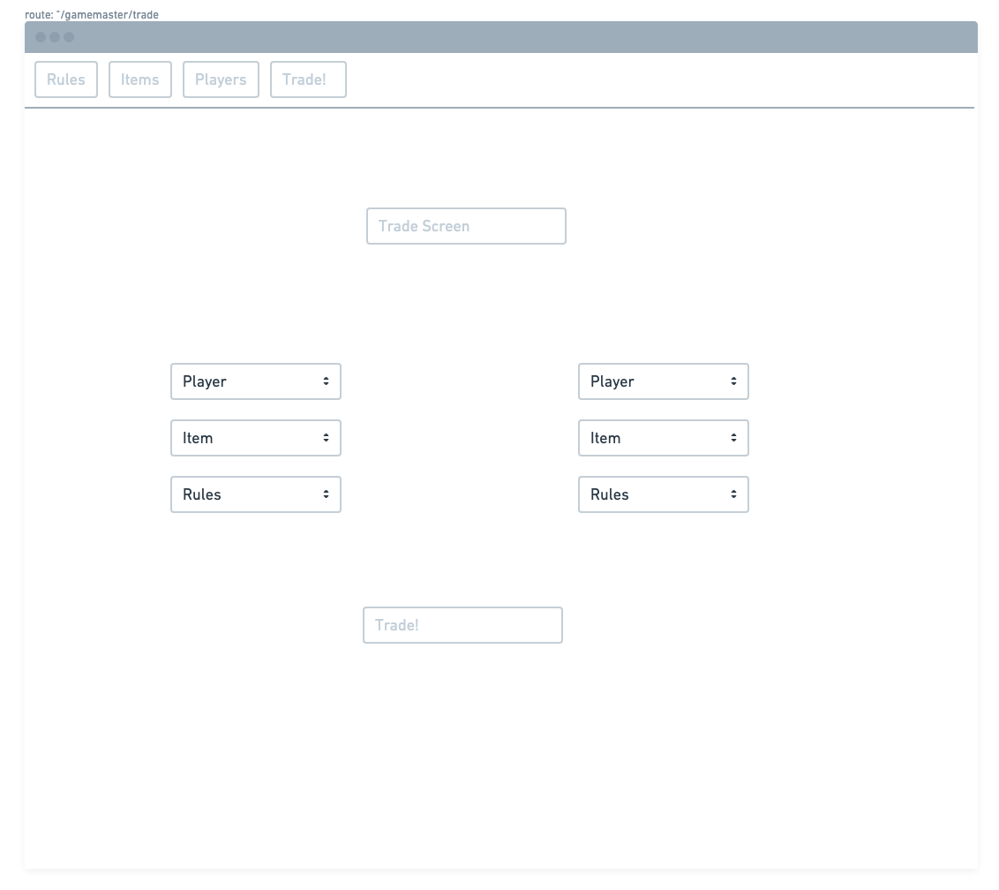
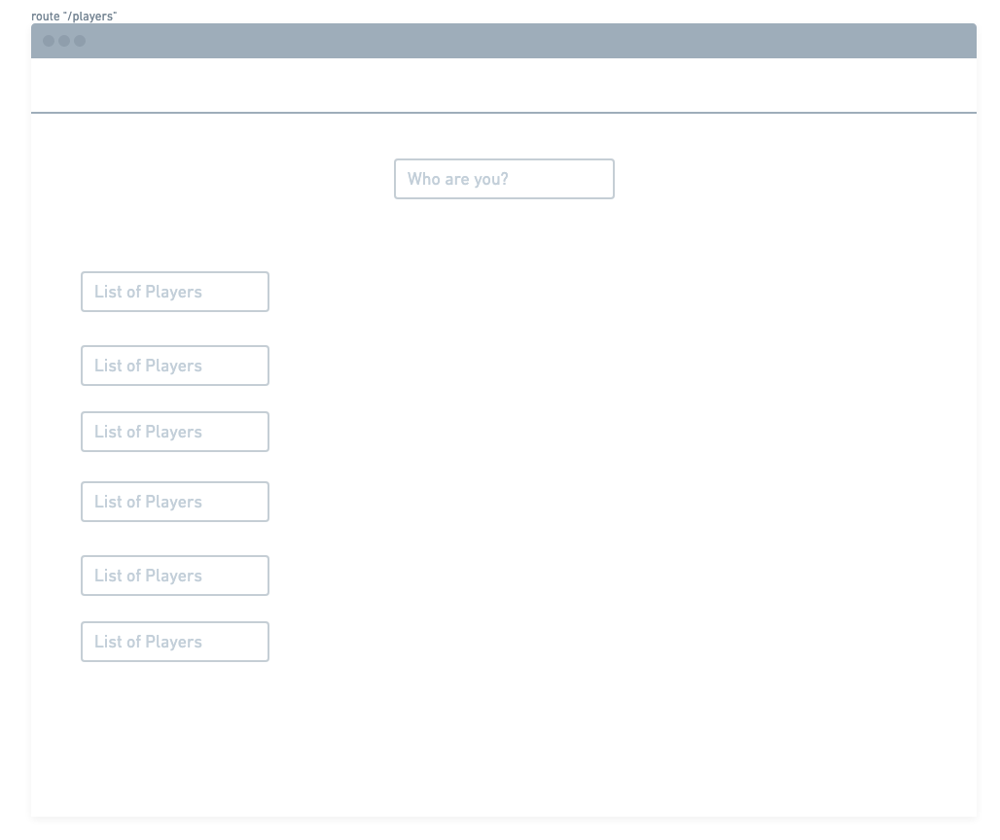
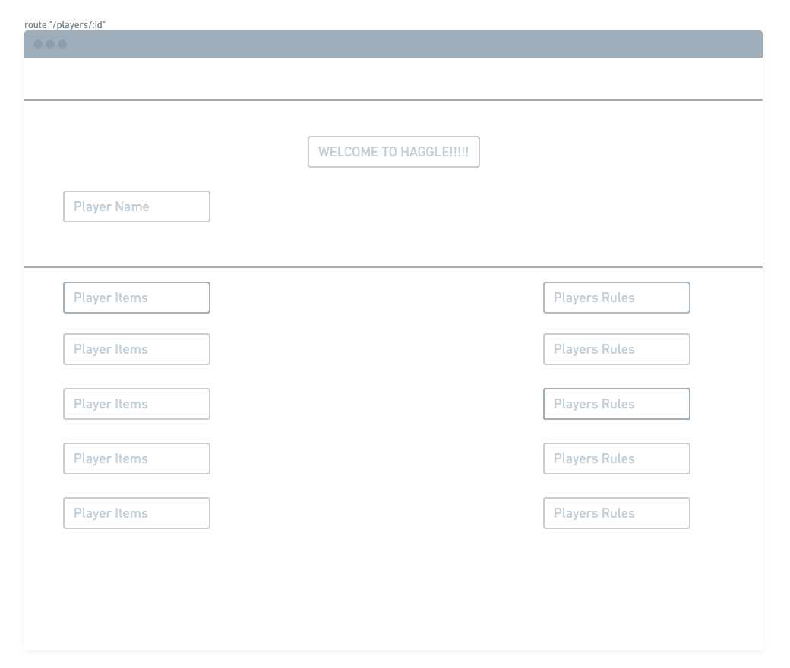
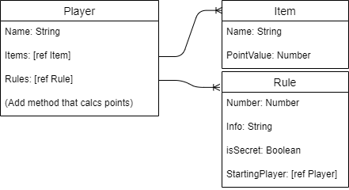

# Haggle!
## The Pitch!
Haggle! is a game where 1 person is Gamemaster and 4 to 8 players trade for items and information! There are 10 Rules to start! 2 of the rules are public, and 8 are divided up evenly amongst each player. Each rule has information on how much certain items are worth and how to get points. It is the goal of each player to trade with the other players to gather as much information as possible and gather the right items together to get the most amount of points by the end of the game. This web app is designed for game masters and players to more easily keep track of items and rules. Right now, it allows players and the game master to create accounts. The gamemaster can then create rules and items, and then give those rules and items to players. The game master can also perform trades between players (players will be assumed to have agreed to this trade outside of the web app), and reflect the change in items and rules for each player, as well as show players a screen detailing all of their current rules and items, and a list of the items other players have. 
## User Stories
### Login
#### Login Scrreen

If not logged in, the Home Page redirects you to a login screen where you can sign in. If you don't have an account you can hit register at the top of the screen.
#### Registration Screren

On the registration screen you can make an account. If there is no gamemaster you will have the option to make your account a gamemaster account. Once your account is made you will be redirected to the login screen.
### Gamemaster
After signing in with a Gamemaster account you are redirected to the Gamemaster Players Screen.
#### Gamemaster Players Screen

In this screen the gamemaster will be shown a list of all the players. Each player will have their scorre shown as well as two buttons redirecting to the Player's Rules, and Player's Items, and as an option to delete that player. Note that player accounts have to be created first for any players to show up in this list!
#### Player Rules and Player Items

Both the Player Rules and Player Items screens function identically. The Gamemaster will see a list of that player's rules/items as well as all of it's information. They will also be able to add more rules/items to that player via a dropdown list at the bottom of the screen. Rules can also be removed.
#### Gamemaster Nav Bar

Of course in order to add rules and items to players they have to exist first. There is a navbar at the top of the screen where the gamemaster can navigate to Items, Rules, Players, or the Trade Screen.
#### Items/Rules

The Items and Rules pages are pages where the gamemaster can see lists of all current Items/Rules. They can directly edit the information, as well as hit a button to delete a rule/item. At the bottom of the page is a section where you can add new rules/items. We decided to do things this way in order to economize on the number of views so that things don't get too confusing for the gamemaster.
#### Extra Rule Functionality

At the bottom of the Rules Page is extra options for rules that will automatically affect player points. You can select a number of items, and then apply an effect if a player has all of those items.
#### Trade

Finally once the gamemaster has added all of the items, rules, and then distributed them out amongst players, the game can properly begin. Whenever two players agree on a trade, the gamemaster can facilitate this by clicking on Trade! in the navbar. This will bring them to the trade screen. The trade screen will have three drop down menus on each side where the gamemaster can choose a Player, any number of that player's items, and any number of that player's rules. (Rules are not "traded" so much as "given"). The gamemaster can then hit the Trade! button to initate the trade which will update the database to reflect the trade.
### Player
#### Player Select

Upon hitting "Players" on the homepage Players will be taken to a Player select where they can choose which player they are. They will then be taken to their Player Screen.
#### Player Screen

The player screen will show the player all of their current items as well as all of their known rules.
## ERD

## Stretch Goals
Further stretch goals include adding messages to the user when login/registration attempts fail, as well as adding item removal from the player. The addition of more complex rule options are also 
